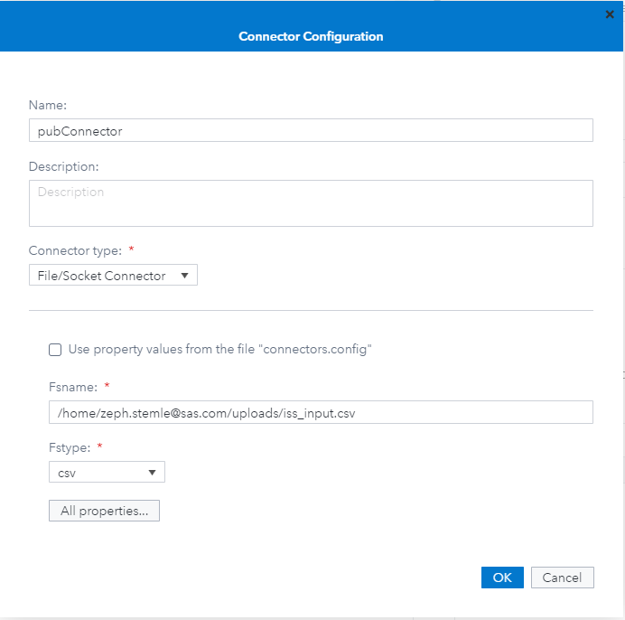
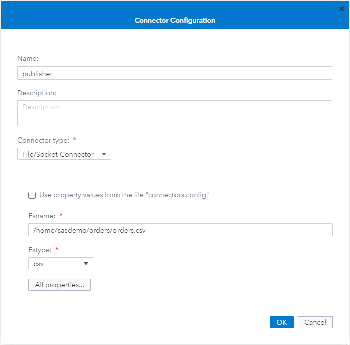

# Editing Input Data (Publisher) Connectors and Subscriber Connectors

By default, all Input Data (Publisher) Connectors and Subscriber Connectors include only the filename of the file being published or subscribed to. You must edit these connectors to include the full path to the files.

To determine if a window includes a connector, look for the   icon. If the icon appears on the left of a window it indicates a publisher connector exists. If the icon appears on the right of a window it indicates a subscriber connector.

## Editing Input Data (Publisher) Connectors

Use the following steps to edit an Input Data (Publisher) Connector:

1.	Ensure the Properties are displayed on the right side of the screen.

2.	Click the window containing the Input Data (Publisher) Connector to select it.

3.	Expand the **Input Data (Publisher) Connectors** section.

4.	Select the connector and click  to open the **Connector Configuration** window.

    

    _Figure 1 - Publisher Connector Configuration_

5.	Edit the **Fsname** field to include the full path to the file.

6.	Click **OK** to close the **Connector Configuration** window.

## Editing Subscriber Connectors

Use the following steps to edit a Subscriber Connector:

1.	Ensure the Properties are displayed on the right side of the screen.

2.	Click the window containing the Subscriber Connector to select it.

3.	Expand the **Subscriber Connectors** section.

4.	Select the connector and click  to open the **Connector Configuration** window.

    

    _Figure 2 - Subscriber Connector Configuration_

5.	Edit the **Fsname** field to include the full path to the file.

6.	Click **OK** to close the **Connector Configuration** window.

