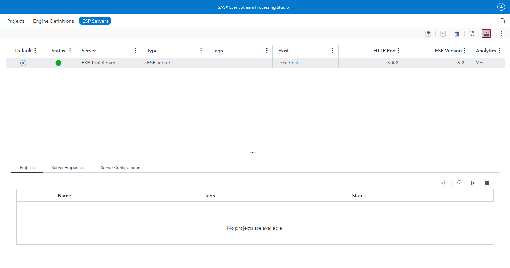
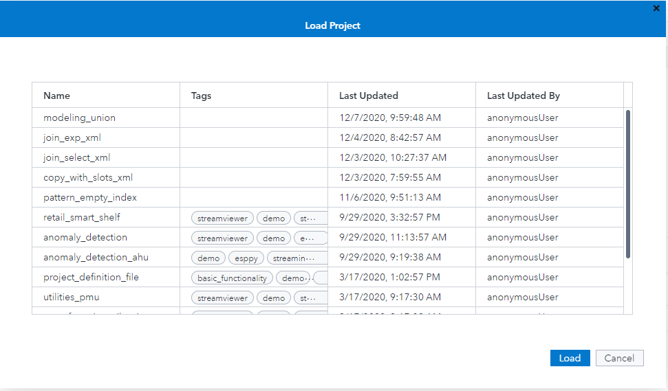
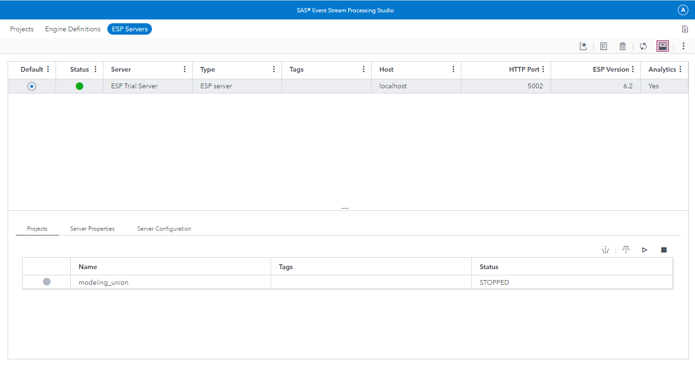
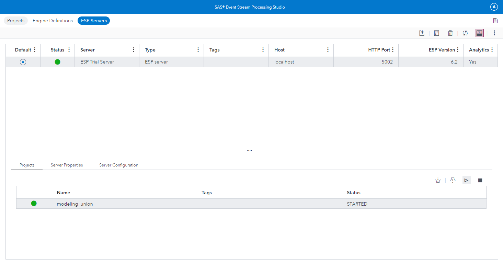
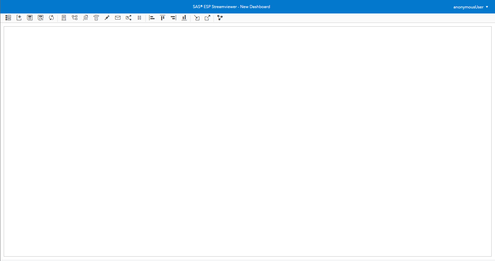
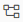
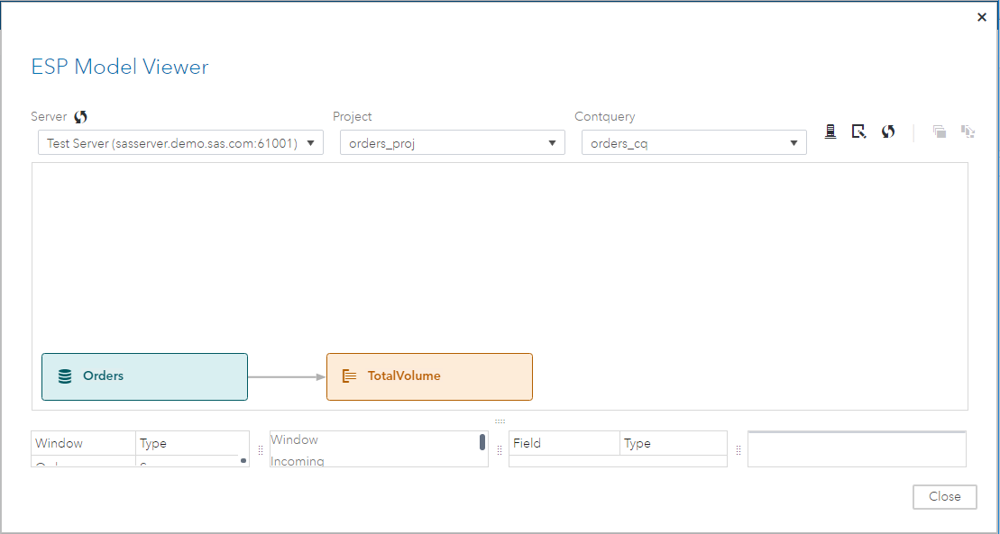
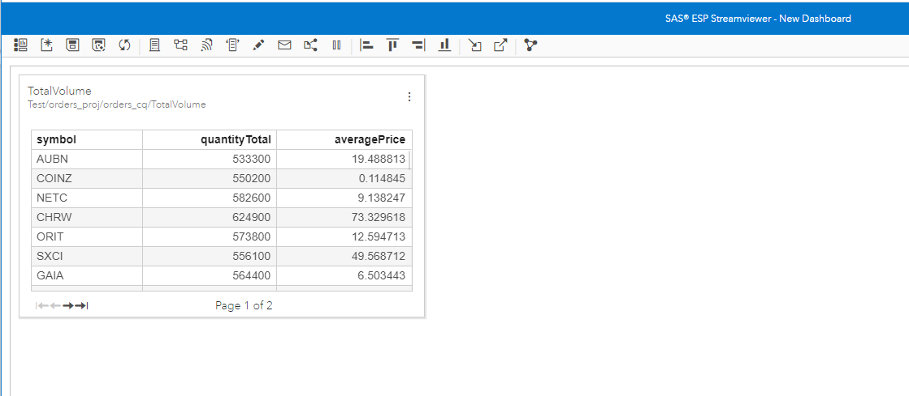

# Executing a Model and Viewing the Output

The following document provides the steps for executing a model on the SAS ESP XML Server and viewing the output using SAS ESP Streamviewer.

## Executing a Model on The SAS ESP XML Server

> The following steps assume you have already uploaded the model to SAS ESP Studio.

1.	If necessary, start SAS ESP Studio.

2.	Click **ESP Servers** to display the ESP Servers screen with the server appearing with a status of green ().

    

    _Figure 1 - ESP Servers Screen_

3.	Near the bottom of the screen, click  to display the **Load Project** window with a list of available projects.

    

    _Figure 2 - Load Project Window_

4.	Click the desired project to select it and click **Load**.
    _The project appears in the projects section of the ESP Servers screen._

    

    _Figure 3 - ESP Servers Screen with Project Loaded_

5.	Click the project to select it and then click  to start the project on the ESP Server. The color of the dot indicates whether the project started successfully or not.
    
    

    _Figure 4 - ESP Servers Screen with Project Running_

## Viewing the Output Using SAS ESP Streamviewer

1.	Start ESP Streamviewer using the following URL:

    ~~~
    https://<Streamviewer-host-name>/SASEventStreamProcessingStreamviewer
    ~~~

    

    _Figure 5 - ESP Streamviewer Dashboard_

2.	On the ESP Streamviewer dashboard, click  to open the **ESP Model Viewer**.

    

    _Figure 6 - ESP Model Viewer_

3.	Click the appropriate window to select it, and then click  to add an updating subscriber to the dashboard. Click **Close** to close the **ESP Model Viewer**.
_The updating subscriber table for the selected window appears on the dashboard._

    

    _Figure 7 - Updating Subscriber_

    