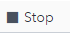

# Testing a Model Using ESP Studio

Use the following steps to test a model using ESP Studio:

1.	Ensure the project is open in ESP Studio.

2.	Click  to save your changes. A project must be saved before it can be tested.

3.	Click  to open the **Test** window.

    

    _Figure 1 - Test Window_

4.	Click  to begin the test. The model will start on the server and the connectors will begin publishing and subscribing.

    

    _Figure 2 - Test Window Showing Results_

5.	Click any of the tabs to view the output from that window.

6.	To stop the test, click .
