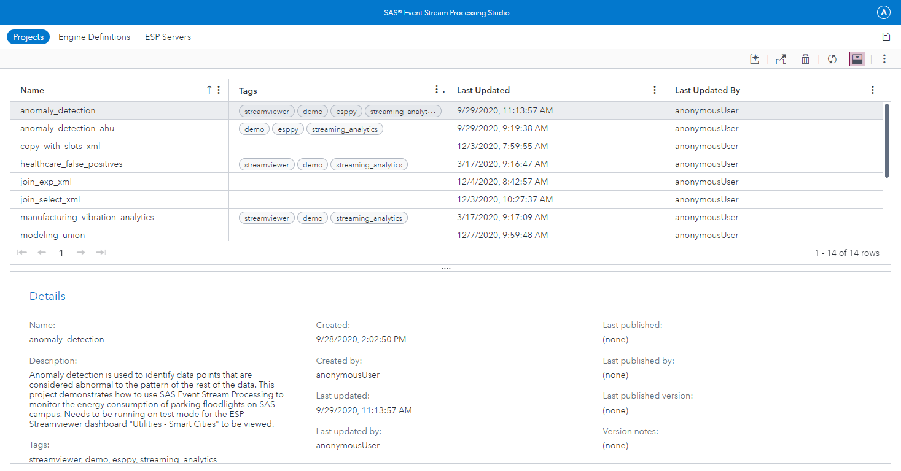
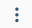

# Uploading a Model to ESP Studio

Use the following steps to upload a model from your local machine to SAS Event Stream Processing (ESP) Studio.

_Figure 1 - ESP Studio Projects_

1.	In the upper-right corner of SAS ESP Studio, click  to reveal the **More actions** menu and select **Upload projects**.
_The Upload Projects window appears._

    

    _Figure 2 - Upload Projects Window_

2.	Click .

3.	Navigate to the file that contains the project that you want to upload and click **Open**.

4.	Click **Upload**. The file is uploaded, and the **Upload Projects** window displays the file, project name, and a green checkmark if the upload was successful.

5.	Click **Close** to close the **Upload Projects** window. The model appears using the Project Name specified in the model.

6.	Double-click the project to open it.

