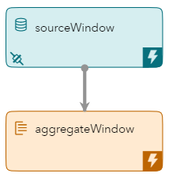
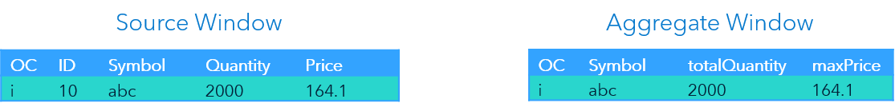
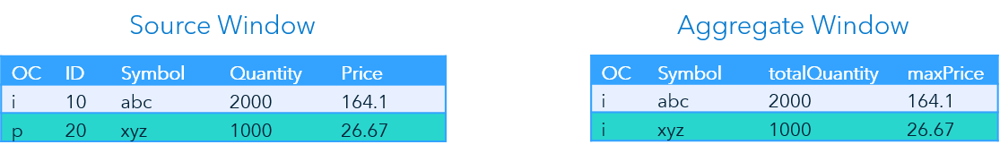
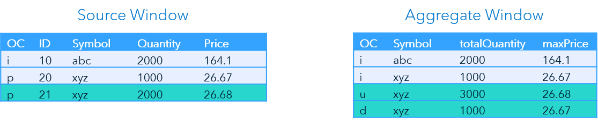
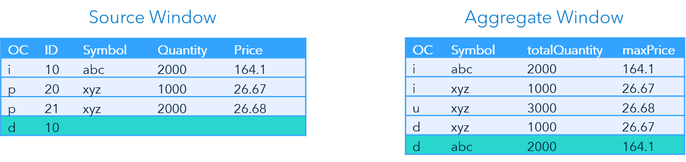
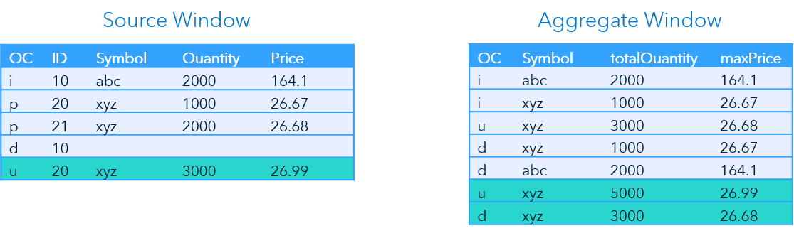
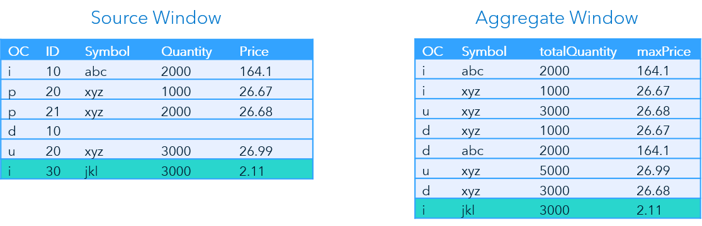

> Refer to the [Instructions](instructions.md) document for steps to execute this code snippet.

# aggregate_exp_xml

The aggregate_exp_xml code snippet includes a source window and an aggregate window that uses registered expressions to perform calculations on non-key fields. 

_Figure 1 - Model_

## Table of Contents

* [Aggregate Window Overview](#aggregate-window-overview)
* [Process Flow Description](#process-flow-description)
	* [Operation Codes](#operation-codes)
	* [Event Flow](#event-flow)
		* [Event 1](#event-1)
		* [Event 2](#event-2)
		* [Event 3](#event-3)
		* [Event 4](#event-4)
		* [Event 5](#event-5)
		* [Event 6](#event-6)
* [Other Repositories Using the Aggregate Window](#other-repositories-using-the-aggregate-window)

## Aggregate Window Overview

When events arrive at an Aggregate window, they are placed into groups determined by the values of the key field. A function or expression is used to perform calculations on non-key values. The result is a scalar value collapsed for each group.
This example uses the field `Symbol` as the key field. `Total Quantity` and `Maximum Price` are calculated for each value of Symbol.

## Process Flow Description

### Operation Codes

An event is an individual record that is part of an event stream. Each event includes a key field that identifies the event and an operation code (OpCode) that is part of the metadata. The following table lists the OpCodes used in this example:

| OpCode | Description |
| ------ | ------ |
| Insert (I) | Adds event data to a window. The key value must be new. |
| Delete (D) | Removes event data from a window. The key value must already exist. |
| Update (U) | Changes event data in a window. The key value must already exist. |
| Upsert (P) | Updates event data in a window if the key value already exists. Adds event data to a window if the key value does not exist. |

> The Upsert OpCode is useful when the user is not sure if a key already exists.

### Event Flow

This example includes six input events. The following is a description of how these events flow through the model.

#### Event 1

_Figure 2 - Event 1_

For the first event input the OpCode is `i` for Insert. The `ID` (key) value is new, so the event is added to the Source window. 

This is the first record for `Symbol abc`, so the Aggregate window event has an OpCode of `i` and the `totalQuantity` is `2000` with a `maxPrice` of `164.1`.

#### Event 2

_Figure 3 - Event 2_

The second event has an OpCode of `p` (Upsert). Since the `ID` value does not previously exist the event is added to the Source window.

Again, this is the first record for `Symbol xyz`. Therefore, the Aggregate window inserts an event with the `totalQuantity` of `1000` and a `maxPrice` of `26.67`.

#### Event 3

_Figure 4 - Event 3_

The next event has an OpCode of `p` once again. The `ID` is new, so the record is added to the Source window.

This is not the first occurrence of `Symbol xyz`. Therefore, the Aggregate window outputs an event block consisting of two events. One is an Update event with an updated `totalQuantity` of `3000` and an updated `maxPrice` of `26.68`, and the other is a Delete event for the previous aggregate event for `Symbol xyz`.

> While Update and Delete events are visible when testing in SAS ESP Studio, they are not included in the output for subscriptions.

#### Event 4

_Figure 5 - Event 4_

The fourth event uses the `d` (Delete) OpCode for `ID 10`. Since the `ID` previously existed the event is removed from the Source window. 

The Aggregate window ouputs a Delete event for `Symbol abc`.

#### Event 5

_Figure 6 - Event 5_

The OpCode value of `u` (Update) is input for `ID 20`. Since `ID 20` previously exists the values for `Symbol`, `Quantity`, and `Price` are updated in the Source window.

The Aggregate window issues an Update event for `symbol xyz` with an updated `totalQuantity` of `5000` and an updated `maxPrice` of `26.99`. Both reflect the values from the updated input event with an `ID` of `20` and the event with an `ID` of `21`. The Aggregate window then outputs a Delete event for the previous values.

#### Event 6

_Figure 7 - Event 6_

A record is added to the Source window for this event. Since this is the first record for `Symbol jkl`, the Aggregate window outputs an Insert event.

## Other Repositories Using the Aggregate Window

- [Zambretti Algorithm for Weather Forecasting](https://github.com/sassoftware/iot-zambretti-weather-forcasting)
- [Aggregating Stock Transactions Using ESP](https://github.com/sassoftware/iot-aggregating-stock-transactions)
- [Processing Streaming Trade Data](https://github.com/sassoftware/iot-process-streaming-trade-data)
- [Event Retention and Calculating Throughput](https://github.com/sassoftware/iot-event-retention-and-calculating-throughput)

