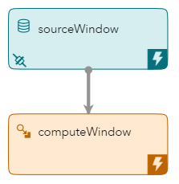
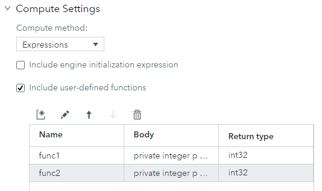
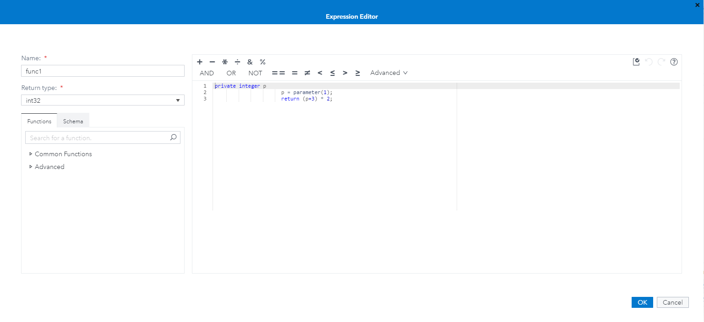
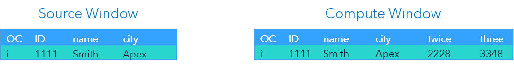
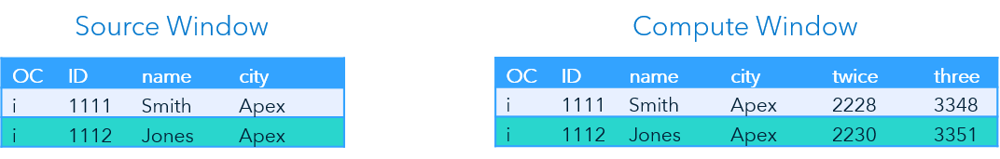
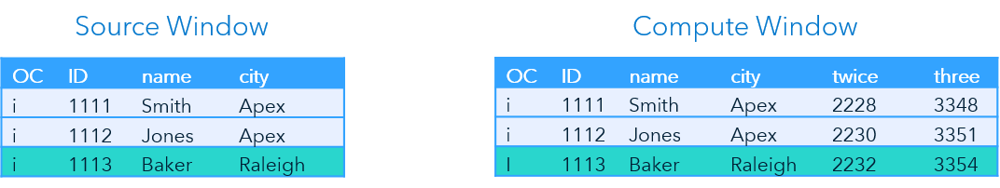

> Refer to the [Instructions](instructions.md) document for steps to execute this code snippet.

# compute_exp_udf_xml

The compute_exp_udf_xml code snippet includes a source window and a compute window that uses user-defined functions to perform calculations on non-key fields. 

_Figure 1 - Model_

## Table of Contents

* [Compute Window Overview](#compute-window-overview)
	* [User-Defined Functions](#user-defined-functions)
		* [Creating User-Defined Functions in SAS ESP Studio](#creating-user-defined-functions-in-sas-esp-studio)
* [Event Flow Description](#event-flow-description)
	* [Event 1](#event-1)
	* [Event 2](#event-2)
	* [Event 3](#event-3)
* [Other Repositories Using the Compute Window](#other-repositories-using-the-compute-window)

## Compute Window Overview

Compute windows enable the one-to-one transformation of input events to output events through computational manipulation of input fields.

Calculations are performed using expressions, user-defined functions, or plug-in functions. This example uses two user-defined functions to perform the calculations.

### User-Defined Functions

User-defined functions are functions written by you, the user. Traditional functions (e.g., match_string) are provided by the environment. The code required by the function is included in the Compute window.

Each user defined function requires three components:

- A name that is used to reference the function
- The data type of the function
- The code to be executed by the function

In this example, user-defined function `func1` has a data type of `int32` and includes the following code:

~~~
private integer p
    p = parameter(1);
    return (p+3) * 2;
~~~

The first line declares new variable `p` as an integer. `p` is then assigned the value of parameter 1 of the function. Finally, the function returns the value of `p` added to 3, multiplied by 2.

The function is called by the following expression in the Compute window:
~~~
func1(ID)
~~~

#### Creating User-Defined Functions in SAS ESP Studio

Use the following steps to create a user-defined function using SAS ESP Studio:

1. Ensure the project is open, compute window is selected, and the properties are displayed.

    

    _Figure 2 - Compute Settings_

2. Expand **Compute Settings**.

3. Under **Compute method**, select **Expressions**.

4. Select **Include user-defined functions**.

5. Click  to open the Expression Editor.

    

    _Figure 3 - Expression Editor_

6. In the Expression Editor, enter a **Name** and select a **Return type**.

7. Using the tools provided, enter the syntax of the user-defined function in the area provided.

8. Click **OK** to save the user-defined function.

Refer to the [Use the Expression Editor](https://go.documentation.sas.com/?cdcId=espcdc&cdcVersion=6.2&docsetId=espstudio&docsetTarget=n0bk8u840zhjd8n0z4c0fkei0a36.htm&locale=en#n1ta4dhkwjf3x3n1dwry4l40bj57) section of the SAS ESP documentation for more information on using the Expression Editor.

Refer to the [Expression Language Reference Guide](https://go.documentation.sas.com/?docsetId=engelref&docsetTarget=titlepage.htm&docsetVersion=v_001&locale=en) for more information on expressions and user-defined functions.

## Event Flow Description

This example includes three input events. The Compute window creates two new fields named `twice` and `three`. The new fields call functions `func1` and `func2` respectively.

The code for `func1` is shown in the above section. The following is the code for function `func2`:

~~~
private integer p
    p = parameter(1);
    return (p+5) * 3;
~~~

The following is a description of how these events flow through the model.

### Event 1

_Figure 4 - Event 1_

The Source window adds the first event and it streams to the Compute window. The Compute window processes the event and outputs values for new fields `twice` and `three`.

Function `func1` is used to calculate `twice`. Variable `p` is set to the value of parameter 1, `1111`. The function then adds 3 and multiplies that sum by 2 giving us `2228`.

Function `func2` calculates new field `three`. Again, `p` is set to `1111` and then 3 is added and the sum is multiplied by 3. The value is `3348`.

### Event 2

_Figure 5 - Event 2_

The second event again inserts an event into Source window and streams to the Compute window. Again, the Compute window processes the event and outputs values for new fields `twice` and `three`.

Function `func1` returns `2230` for field `two`. Function `func2` returns `3351` for field `three`.

### Event 3

_Figure 6 - Event 3_

The last event is inserted into the Source window and streams to the Compute window. The Compute window processes the event and calculates the values for fields `two` and `three`.

## Other Repositories Using the Compute Window

- [Zambretti Algorithm for Weather Forecasting](https://github.com/sassoftware/iot-zambretti-weather-forcasting)
- [Processing Streaming Trade Data](https://github.com/sassoftware/iot-process-streaming-trade-data)
- [Event Retention and Calculating Throughput](https://github.com/sassoftware/iot-event-retention-and-calculating-throughput)
- [compute_exp_xml](../compute_exp_xml)

