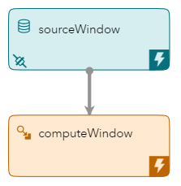
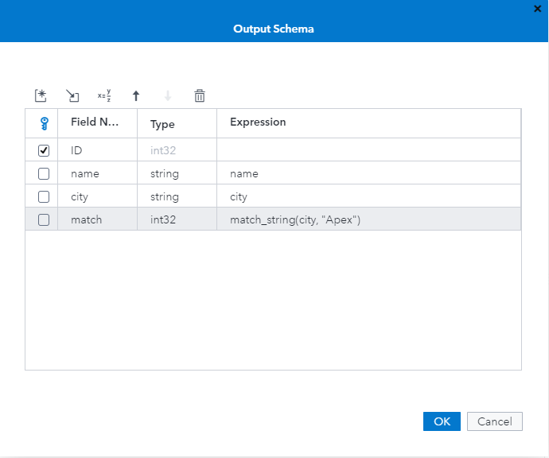
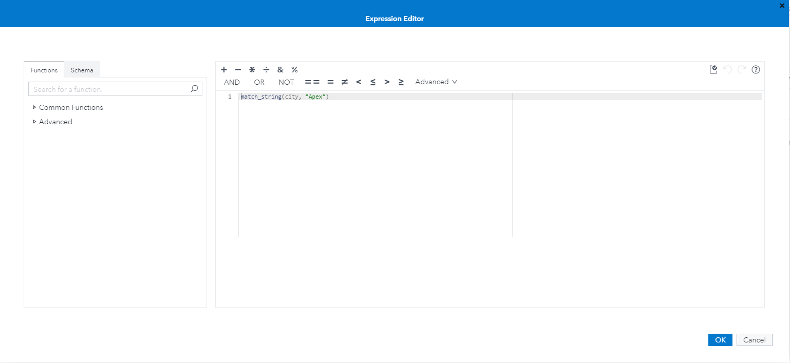
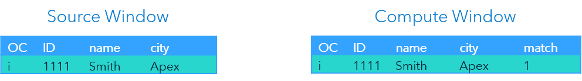
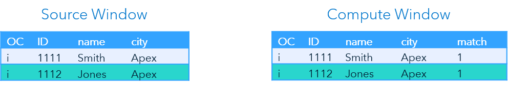
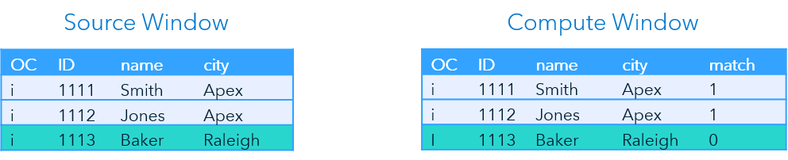

> Refer to the [Instructions](instructions.md) document for steps to execute this code snippet.

# compute_exp_xml

The compute_exp_xml code snippet includes a source window and a compute window that uses expressions to perform calculations on non-key fields.

_Figure 1 - Model_

## Table of Contents

* [Compute Window Overview](#compute-window-overview)
	* [Expressions](#expressions)
	* [Creating Expressions in SAS ESP Studio](#creating-expressions-in-sas-esp-studio)
* [Event Flow Description](#event-flow-description)
	* [Event 1](#event-1)
	* [Event 2](#event-2)
	* [Event 3](#event-3)
* [Other Repositories Using the Compute Window](#other-repositories-using-the-compute-window)

## Compute Window Overview

Compute windows enable the one-to-one transformation of input events to output events through computational manipulation of input fields.

Calculations are performed using expressions, user defined functions, or plug-in functions. This example uses an expression to perform the calculations.

### Expressions

The Expression Engine Language (EEL) provides statements, functions, and variables for manipulating data. An expression can include operators in conjunction with numbers, strings, functions, and functions that use other functions. Examples of expressions include:

~~~
price * 0.95
~~~

~~~
match_string(city, "London")
~~~

Refer to the [Expression Language Reference Guide](https://go.documentation.sas.com/?docsetId=engelref&docsetTarget=titlepage.htm&docsetVersion=v_001&locale=en) for more information on using the Expression Engine Language.

### Creating Expressions in SAS ESP Studio

Use the following steps to create an expression using SAS ESP Studio:

1. Ensure the project is open, compute window is selected, and the schema is displayed.

2. Click  to open and edit the Output Schema screen.

    

    _Figure 2 - Output Schema_

3. Expressions can be entered in one of two ways:

    - Enter the syntax into the Expression field of the Output Schema.

    - Click  to open the Expression Editor

    

    _Figure 3 - Expression Editor_

4. In the Expression Editor, enter a **Name** and select a **Return type**.

5. Using the tools provided, enter the syntax of the expression in the area provided.

6. Click  to validate the expression.

7. Click **OK** to save the expression.

Refer to the [Use the Expression Editor](https://go.documentation.sas.com/?cdcId=espcdc&cdcVersion=6.2&docsetId=espstudio&docsetTarget=n0bk8u840zhjd8n0z4c0fkei0a36.htm&locale=en#n1ta4dhkwjf3x3n1dwry4l40bj57) section of the SAS ESP documentation for more information on using the Expression Editor.

## Event Flow Description

This example includes three input events. The Compute window creates a new field named `match`. The new field is calculated using the following expression:

~~~
match_string(city, “Apex”)
~~~

The following is a description of how these events flow through the model.

### Event 1

_Figure 4 - Event 1_

The Source window adds the first event and it streams to the Compute window. The Compute window processes the event and outputs  a `1` for field `match`, because the `match_string` function returned `true`.

### Event 2

_Figure 5 - Event 2_

The second event again inserts an event into Source window and streams to the Compute window. Again, the Compute window processes the event and outputs a value of `1` for field `match`, because the `match_string` function again returned `true`.

### Event 3

_Figure 6 - Event 3_

The last event is inserted into the Source window and streams to the Compute window. The Compute window processes the event and, for this event, outputs a `0` for field `match`, because the function returned `false`.

## Other Repositories Using the Compute Window

- [Zambretti Algorithm for Weather Forecasting](https://github.com/sassoftware/iot-zambretti-weather-forcasting)
- [Processing Streaming Trade Data](https://github.com/sassoftware/iot-process-streaming-trade-data)
- [Event Retention and Calculating Throughput](https://github.com/sassoftware/iot-event-retention-and-calculating-throughput)
- [compute_exp_udf_xml](../compute_exp_udf_xml)
