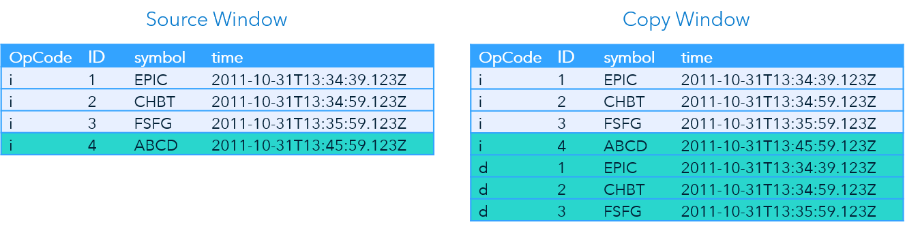

> Refer to the [Instructions](instructions.md) document for steps to execute this code snippet.

# copy_with_retention_xml

The copy_with_retention_xml code snippet contains a single source window followed by one copy window. The copy window retains events for 300 seconds based on a field in the event. 

_Figure 1 - Model_

## Table of Contents

* [Copy Window Overview](#copy-window-overview)
	* [Event Retention](#event-retention)
	* [Setting Retention Policies in SAS ESP Studio](#setting-retention-policies-in-sas-esp-studio)
* [Event Flow Description](#event-flow-description)
	* [Event 1](#event-1)
	* [Event 2](#event-2)
	* [Event 3](#event-3)
	* [Event 4](#event-4)
	* [Event 5](#event-5)
	* [Event 6](#event-6)
* [Other Repositories Using the Copy Window with Retention](#other-repositories-using-the-copy-window-with-retention)

## Copy Window Overview

You can use a Copy window to copy a parent window and retain events using specified retention policies. 

### Event Retention

You can set a retention policy in a Source or Copy window. Retention policies govern how Deletes are introduced into the event stream. Once introduced, these Deletes work their way along the data flow, recomputing the model along the way.

The retention type and variant determine the retention policy. The type reflects whether to use time or the number of events as a threshold. The variant determines what happens when the threshold is reached. The following table lists the four types of retention policies and provides an explanation of each:

| Type | Description |
| ------ | ------ |
| bytime-sliding | Retention is based on the age of events. The age is calculated by subtracting last modification time from current time. Time can be the system clock or a time field embedded in the data. When the specified time threshold is exceeded, events are deleted. |
| bytime-jumping | Retention is based on the age of events. The age is calculated by subtracting last modification time from current time. Time can be the system clock or a time field embedded in the data. When the specified time threshold is exceeded, the contents of the window is cleared. |
| bycount-sliding | Retention is based on a specified number of events. When the specified threshold is exceeded, events are deleted. |
| bycount-jumping | Retention is based on a specified number of events. When the specified threshold is exceeded, the contents of the window is cleared. |

This example uses the `bytime_sliding` type and variant with the value set to 300 seconds. The example uses a field named `time`, not the system clock, to determine the threshold.

### Setting Retention Policies in SAS ESP Studio

Use the following steps to set a retention policy using SAS ESP Studio:

1. Ensure the project is open, copy window is selected, and the properties are displayed.

2. Expand **Retention**.

    

    _Figure 2 - Retention Settings_

3. Under **Type**, select the appropriate retention type and variant.

4. Under **Time limit**, type the number of time units, and then select the unit of time from the selection list.

5. Under **Time field**, select either **(use system clock)** or select an input field to use.

## Event Flow Description

This example includes six input events. The Copy window retains events for 300 seconds based on the field named `time`.
The following is a description of how these events flow through the model.

### Event 1

_Figure 3 - Event 1_

The Source window adds the first event and it streams to the Copy window. The Copy window processes the event and retains it. The event will be deleted from the Copy window when 300 seconds have elapsed in the `time` field.

### Event 2

_Figure 4 - Event 2_

The second event again inserts an event into Source window and streams to the Copy window. Again, the Copy window processes the event and retains it.

The Copy window also retains the first event, because the value in the `time` field for the new event is within 300 seconds of the `time` field value of the first event.

### Event 3

_Figure 5 - Event 3_

The third event is inserted into the Source window and streams to the Copy window. The Copy window processes the event and retains it for 300 seconds.

The first two events are also retained by the Copy window.

### Event 4

_Figure 6 - Event 4_

The next event is inserted into the Source window. Notice the `time` field for the fourth event includes a value that is about 10 minutes later than the `time` of the first three events. The event streams to the Copy window.

The Copy window processes an event for ID 4. However, because the `time` value of the `ID` 4 is more than 300 seconds past the time values of `IDs` 1, 2, and 3, three Delete events are introduced into the stream for the first three events.

### Event 5

_Figure 7 - Event 5_

The event for `ID` 5 is inserted into the Source window and streams to the Copy window. The Copy window processes the event and retains the event for `ID` 4, because 300 seconds have not elapsed.

### Event 6

_Figure 8 - Event 6_

The last event is also inserted into the Source window and streams to the Copy window where it is retained along with the events for `IDs` 4 and 5.

## Other Repositories Using the Copy Window with Retention

- [Event Retention and Calculating Throughput](https://github.com/sassoftware/iot-event-retention-and-calculating-throughput)
 