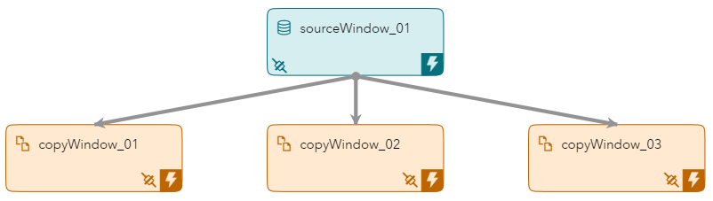
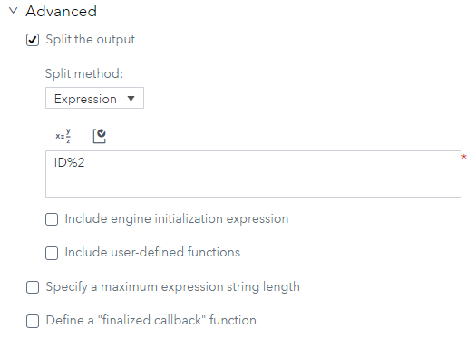
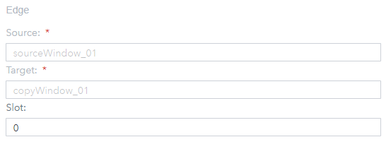
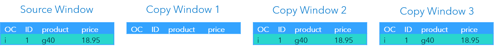
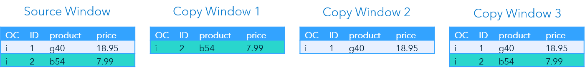
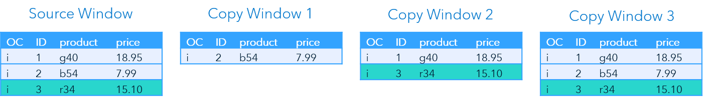
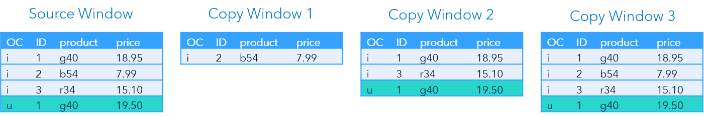
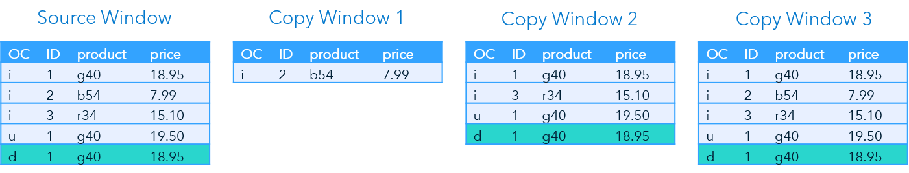

> Refer to the [Instructions](instructions.md) document for steps to execute this code snippet.

# copy_with_slots_xml

The copy_with_slots_xml code snippet includes a single source window using output slots to feed different event subsets to three copy windows based on an output slot function.

_Figure 1 - Model_

## Table of Contents

* [Splitting Event Streams Overview](#splitting-event-streams-overview)
	* [Splitter Expressions](#splitter-expressions)
	* [Entering Splitter Expressions in SAS ESP Studio](#entering-splitter-expressions-in-sas-esp-studio)
	* [Output Slots](#output-slots)
	* [Assigning Slot Numbers to Edges in SAS ESP Studio](#assigning-slot-numbers-to-edges-in-sas-esp-studio)
* [Event Flow Description](#event-flow-description)
	* [Event 1](#event-1)
	* [Event 2](#event-2)
	* [Event 3](#event-3)
	* [Event 4](#event-4)
	* [Event 5](#event-5)
* [Other Repositories Using the Copy Window with Slots](#other-repositories-using-the-copy-window-with-slots)

## Splitting Event Streams Overview

Event streams can be split among multiple output slots of a window. All events can be output across all slots, or events can be directed to specific output slots based on the results of a function or expression.

Using splitters is more efficient than using multiple Filter windows to split an event stream. This is because the splitter expression performs the filtering once, instead of once for each Filter window.

### Splitter Expressions

All window types can register a splitter function or expression to determine what output slots to use. The results of the splitter expression match one of the slot numbers assigned to the output slots.

The following is an example of a splitter expression:

~~~
ID%2
~~~

The above expression uses the modulo operator which returns the remainder after dividing `value 1` by `value 2`. In the above expression, the value of field `ID` is divided by `2`. Therefore, the remainder is either `0` or `1`.

### Entering Splitter Expressions in SAS ESP Studio

Use the following steps to enter a splitter expression to a window using SAS ESP Studio:

1. Ensure the project is open, desired window is selected, and the properties are displayed.

2. Expand **Advanced**.

    

    _Figure 2 - Advanced Properties_

3.  Click **Split the output**.

4. Ensure **Expression** is selected under **Split method**.

5. You can enter the expression in one of two ways:

    - Type the expression in the space provided.

    - Click  to open the Expression Editor. Refer to the [Use the Expression Editor](https://go.documentation.sas.com/?cdcId=espcdc&cdcVersion=6.2&docsetId=espstudio&docsetTarget=n0bk8u840zhjd8n0z4c0fkei0a36.htm&locale=en#n1ta4dhkwjf3x3n1dwry4l40bj57) section of the SAS ESP documentation for more information on using the Expression Editor.

6. Click  to validate the expression.

### Output Slots

Slot numbers are assigned to output slots when you add edges between a window with a splitter expression and a downstream window. For example, if an edge is assigned slot number 0, the downstream window will receive events when the results of the splitter expression are 0.

A slot number of -1 can be used to indicate the downstream window is to receive all events.

### Assigning Slot Numbers to Edges in SAS ESP Studio

Use the following steps to assign a slot number to an edge using SAS ESP Studio:

1. Ensure the project is open. 

2. Click the edge connector between windows to select it and display the properties.

    

    _Figure 3 - Edge Properties_

3. Under **Slot**, type the slot number you wish to assign to the edge.

## Event Flow Description

This example includes five input events. The Source window includes the splitter expression, `ID%2`. The edge between the Source window and Copy Window 1 is set to slot number `0`. The edge between the Source window and Copy Window 2 is set to slot number `1`. The edge between the Source window and Copy Window 3 is set to slot number `-1`.

The following is a description of how these events flow through the model.

### Event 1

_Figure 4 - Event 1_

The Source window inserts the first event. Since the `ID` value is `1`, output slot `1` is used. Therefore, Copy Window 2 (slot number `1`) and Copy Window 3 (slot number `-1`) receive the event and insert it.

### Event 2

_Figure 5 - Event 2_

The second event again inserts an event into the Source window. The `ID` value is `2`, so output slot `0` is used. Copy Window 1 (slot number `0`) and Copy Window 3 receive the event and insert it.

### Event 3

_Figure 6 - Event 3_

The third event is inserted into the Source with an `ID` value of `3`. Therefore, output slot `1` is used and Copy Window 2 and Copy Window 3 receive the event.

### Event 4

_Figure 7 - Event 4_

The next event is an Update event for `ID 1`. Output slot `1` is used and both Copy Window 2 and Copy Window 3 receive the update.

### Event 5

_Figure 8 - Event 5_

The last event is a Delete for the original record for `ID 1`. Again, output slot `1` is used and the Delete is sent to Copy Window 2 and Copy Window 3.

## Other Repositories Using the Copy Window with Slots

- [Splitting Data Streams in ESP](https://github.com/sassoftware/iot-splitting-data-streams-esp)