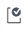

> Refer to the [Instructions](instructions.md) document for steps to execute this code snippet.

# filter_exp_xml

The filter_exp_xml code snippet contains a single source window and filter window with a filter expression. 

_Figure 1 - Model_

## Table of Contents

* [Filter Window Overview](#filter-window-overview)
	* [Filter Conditions](#filter-conditions)
	* [Entering Filter Conditions in SAS ESP Studio](#entering-filter-conditions-in-sas-esp-studio)
* [Event Flow Description](#event-flow-description)
	* [Event 1](#event-1)
	* [Event 2](#event-2)
	* [Event 3](#event-3)
	* [Event 4](#event-4)
	* [Event 5](#event-5)
	* [Event 6](#event-6)
* [Other Repositories Using the Filter Window with Filter Expressions](#other-repositories-using-the-filter-window-with-filter-expressions)

## Filter Window Overview

Filter windows allow only certain events to stream through to the downstream portion of the model. They use expressions, user-defined functions, and registered plug-in functions as filter conditions.

### Filter Conditions

A filter condition determines which events can pass through the Filter window. The results of the condition are always either true or false. When true the events pass through, when false they do not.

The following is an example of a filter condition that uses an expression:

~~~
price > 1.00
~~~

If the value of field `price` is greater than 1.00, the event will pass through the Filter window. Otherwise it will not.

### Entering Filter Conditions in SAS ESP Studio

Use the following steps to enter a filter condition using SAS ESP Studio:

1. Ensure the project is open, filter window is selected, and the properties are displayed.

2. Expand **Filter**.

    

    _Figure 2 - Filter Conditions_

3. Ensure **Expression** is selected under **Filter method**.

4. You can enter the expression in one of two ways:

    - Type the expression in the space provided.

    - Click  to open the Expression Editor. Refer to the [Use the Expression Editor](https://go.documentation.sas.com/?cdcId=espcdc&cdcVersion=6.2&docsetId=espstudio&docsetTarget=n0bk8u840zhjd8n0z4c0fkei0a36.htm&locale=en#n1ta4dhkwjf3x3n1dwry4l40bj57) section of the SAS ESP documentation for more information on using the Expression Editor.

5. Click  to validate the expression.

## Event Flow Description

This example includes six input events. The Filter window is using the expression `quantity > 100` as the filter condition.

The following is a description of how these events flow through the model.

### Event 1

_Figure 3 - Event 1_

The Source window adds the first event and it streams to the Filter window. The Filter window inserts the event, because the `quantity` value is greater than 1000.

### Event 2

_Figure 4 - Event 2_

The second event again inserts an event into Source window and streams to the Filter window. However, because the `quantity` is 1000 and not greater than 1000, the event is blocked by the Filter window.

### Event 3

_Figure 5 - Event 3_

The third event has a Delete OpCode and will be deleted from the Source window. The Filter window also deletes the event, because the `quantity` is greater than 1000. If the filter condition had not been true, the event would not have been deleted from the Filter window.

### Event 4

_Figure 6 - Event 4_

The next event has an OpCode of u for Update. The event is updated in the Source window. The Filter window inserts the event because the `quantity` is greater than 1000.

The reason the Filter window OpCode for this event is Insert and not Update is because the original event being updated was never inserted into the Filter window.

### Event 5

_Figure 7 - Event 5_

The fifth event is a Delete for `ID` 10, which was just updated. The Filter window does nothing with the event because the `quantity` is not greater than 1000.

### Event 6

_Figure 8 - Event 6_

The last event is inserted into the Source window and streams to the Filter window where it is inserted because of the `quantity` value.

## Other Repositories Using the Filter Window with Filter Expressions

- [Zambretti Algorithm for Weather Forecasting](https://github.com/sassoftware/iot-zambretti-weather-forcasting)
- [Tracking the International Space Station](https://github.com/sassoftware/iot-tracking-the-iss)
- [Processing Streaming Trade Data](https://github.com/sassoftware/iot-process-streaming-trade-data)

