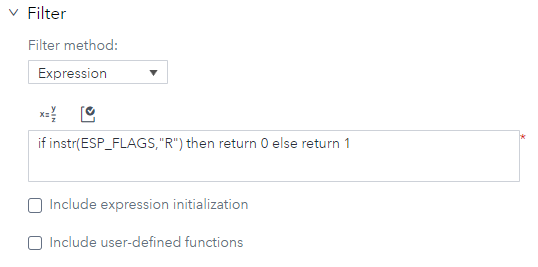
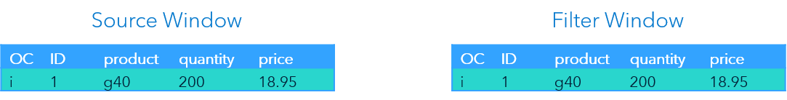
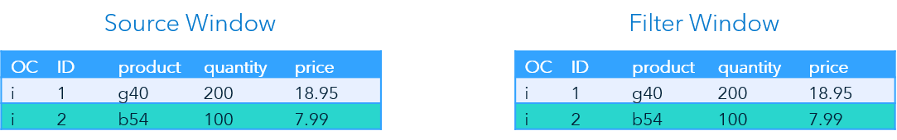
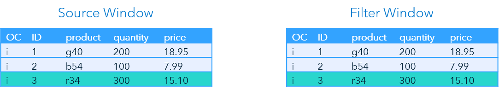
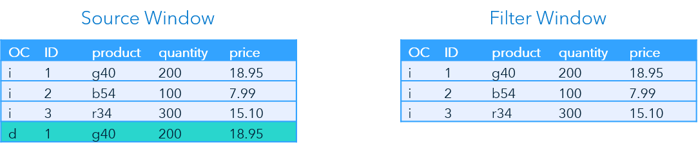
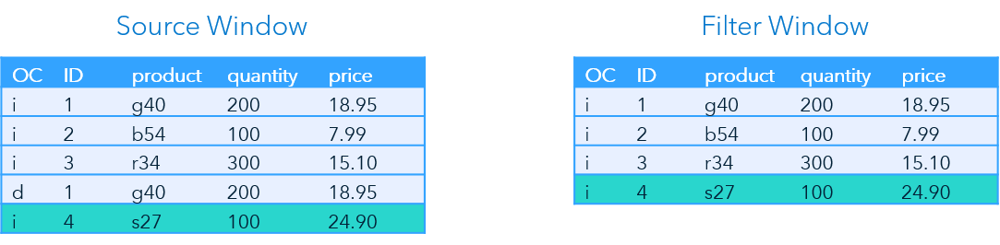

> Refer to the [Instructions](instructions.md) document for steps to execute this code snippet.

# filter_on_flag_xml

The filter_on_flag_xml code snippet includes a single source window followed by one filter window. The filter window uses ESP_FLAGS to filter out all retention deletes.

_Figure 1 - Model_

## Table of Contents

* [Filter Window Overview](#filter-window-overview)
	* [ESP Flags](#esp-flags)
	* [Expression](#expression)
	* [Entering Filter Conditions in SAS ESP Studio](#entering-filter-conditions-in-sas-esp-studio)
* [Event Flow Description](#event-flow-description)
	* [Event 1](#event-1)
	* [Event 2](#event-2)
	* [Event 3](#event-3)
	* [Event 4](#event-4)
	* [Event 5](#event-5)

## Filter Window Overview

Filter windows allow only certain events to stream through to the downstream portion of the model. They use expressions, user-defined functions, and registered plug-in functions as filter conditions. This example uses an expression to filter out a specific flag set by ESP.

### ESP Flags

Events include two types of metadata, the operation code (OpCode) and the flags of the event. There are three possible flags:

- N – Normal
- P – Partial
- R – Retention Delete

The Retention Delete flag is set when a Delete event is introduced into the stream because a retention policy has expired. For example, if a Source window is set to retain the two most current events, it will introduce a Delete into the stream for the first event when the third event is inserted.

There can be multiple flags set for a single event.

### Expression

The following expression is used to filter out events with a Retention Delete flag:

~~~
if instr(ESP_FLAGS,"R") then return 0 else return 1
~~~

The `INSTR` function returns the position of one string withing another string. Therefore, if `R` exists in the string `ESP_FLAGS`, return a 0 to filter out these events.

> ESP_FLAGS is a reserved word that does not need to be defined or declared.

### Entering Filter Conditions in SAS ESP Studio

Use the following steps to enter a filter condition using SAS ESP Studio:

1. Ensure the project is open, filter window is selected, and the properties are displayed.

2. Expand **Filter**.

    

    _Figure 2 - Filter Conditions_

3. Ensure **Expression** is selected under **Filter method**.

4. You can enter the expression in one of two ways:

    - Type the expression in the space provided.

    - Click  to open the Expression Editor. Refer to the [Use the Expression Editor](https://go.documentation.sas.com/?cdcId=espcdc&cdcVersion=6.2&docsetId=espstudio&docsetTarget=n0bk8u840zhjd8n0z4c0fkei0a36.htm&locale=en#n1ta4dhkwjf3x3n1dwry4l40bj57) section of the SAS ESP documentation for more information on using the Expression Editor.

5. Click  to validate the expression.

## Event Flow Description

This example includes six input events. The Source window has a retention policy set to retain the most recent two events. The Filter window is using the expression in the above section to filter out any event with the Retention Delete flag.

The following is a description of how these events flow through the model.

### Event 1

_Figure 3 - Event 1_

The Source window adds the first event and retains it. The event streams to the Filter window where it is inserted, because the Retention Delete flag is not present in the metadata.

### Event 2

_Figure 4 - Event 2_

The second event again inserts an event into the Source window and it is again retained because it is one of the two most recent events The event streams to the Filter window where it is inserted, because the Retention Delete flag is not present in the metadata.

### Event 3

_Figure 5 - Event 3_

The third event is inserted into the Source and Filter windows.

### Event 4

_Figure 6 - Event 4_

The next event is a Delete for the first event introduced into the stream because the retention policy is set to retain the two most recent events.

The Filter window does not insert this event because the Retention Delete flag is set in the event’s metadata.

### Event 5

_Figure 7 - Event 5_

The last event is an Insert. Therefore, it will be inserted in both windows. The next event (not shown) will be a Delete for the second event because of the retention policy.

