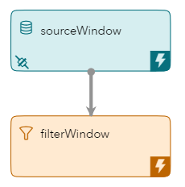
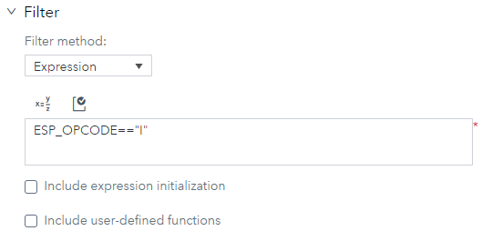
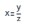
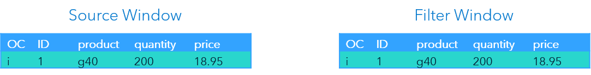
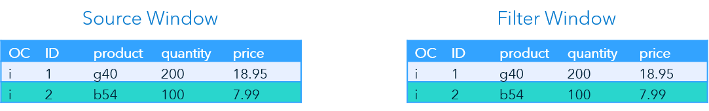
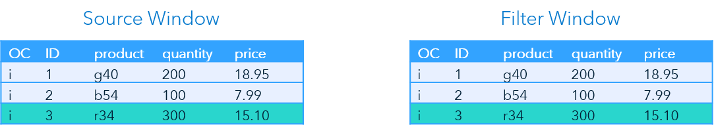
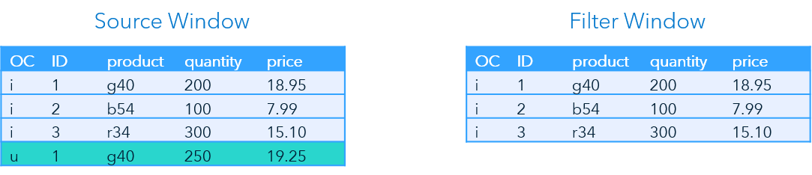
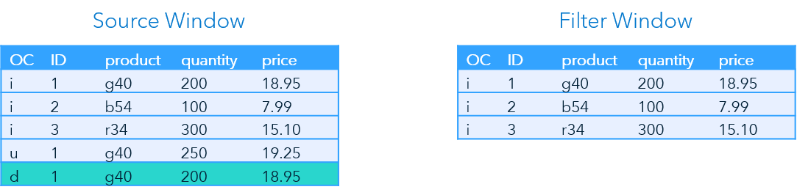

> Refer to the [Instructions](instructions.md) document for steps to execute this code snippet.

# filter_on_opcode_xml

The filter_on_opcode_xml code snippet includes a single source window followed by one filter window. The filter window uses ESP_OPCODE to filter out all but events with an OpCode of Insert.

_Figure 1 - Model_

## Table of Contents

* [Filter Window Overview](#filter-window-overview)
	* [ESP OpCodes](#esp-opcodes)
	* [Entering Filter Conditions in SAS ESP Studio](#entering-filter-conditions-in-sas-esp-studio)
* [Event Flow Description](#event-flow-description)
	* [Event 1](#event-1)
	* [Event 2](#event-2)
	* [Event 3](#event-3)
	* [Event 4](#event-4)
	* [Event 5](#event-5)

## Filter Window Overview

Filter windows allow only certain events to stream through to the downstream portion of the model. They use expressions, user-defined functions, and registered plug-in functions as filter conditions. This example uses an expression to filter out events except those with an OpCode of Insert.

### ESP OpCodes

Events include two types of metadata, the operation code (OpCode) and the flags of the event. The following table lists the OpCodes used by ESP and provides a description of each:

| OpCode | Description |
| ------ | ------ |
| Insert (I) | Adds event data to a window. The key value must be new. |
| Delete (D) | Removes event data from a window. The key value must already exist. |
| Update (U) | Changes event data in a window. The key value must already exist. |
| Upsert (P) | Updates event data in a window if the key value already exists. Adds event data to a window if the key value does not exist. |
| Safe Delete (SD) | Removes event data from a window without generating an error if the key value does not exist. |

The following expression is used to filter out events except those with an OpCode of Insert:

~~~
ESP_OPCODE=="I"
~~~

> ESP_OPCODE is a reserved word that does not need to be defined or declared.

### Entering Filter Conditions in SAS ESP Studio

Use the following steps to enter a filter condition using SAS ESP Studio:

1. Ensure the project is open, filter window is selected, and the properties are displayed.

2. Expand **Filter**.

    

    _Figure 2 - Filter Conditions_

3. Ensure **Expression** is selected under **Filter method**.

4. You can enter the expression in one of two ways:

    - Type the expression in the space provided.

    - Click  to open the Expression Editor. Refer to the [Use the Expression Editor](https://go.documentation.sas.com/?cdcId=espcdc&cdcVersion=6.2&docsetId=espstudio&docsetTarget=n0bk8u840zhjd8n0z4c0fkei0a36.htm&locale=en#n1ta4dhkwjf3x3n1dwry4l40bj57) section of the SAS ESP documentation for more information on using the Expression Editor.

5. Click  to validate the expression.

## Event Flow Description

This example includes five input events. The Filter window is using the expression, `ESP_OPCODE==”I”`, to filter out all events except those with an OpCode of Insert.

The following is a description of how these events flow through the model.

### Event 1

_Figure 3 - Event 1_

The Source window inserts the first event. The event streams to the Filter window where it is inserted, because the OpCode is Insert (i).

### Event 2

_Figure 4 - Event 2_

The second event again inserts an event into the Source window. The event streams to the Filter window where it is inserted, because the OpCode is Insert again.

### Event 3

_Figure 5 - Event 3_

The third event is inserted into the Source and Filter windows.

### Event 4

_Figure 6 - Event 4_

The next event is an Update for the first event (ID 1). The Filter window does not insert this event because the OpCode is Update.

### Event 5

_Figure 7 - Event 5_

The last event is a Delete for the original record for ID 1. Because it has an OpCode of Delete, the event is not inserted into the Filter window.
