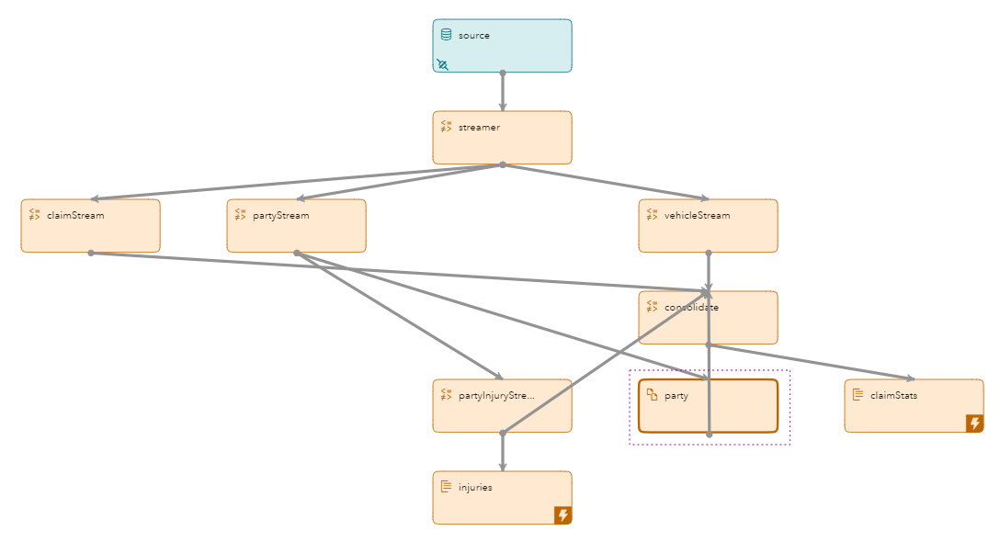
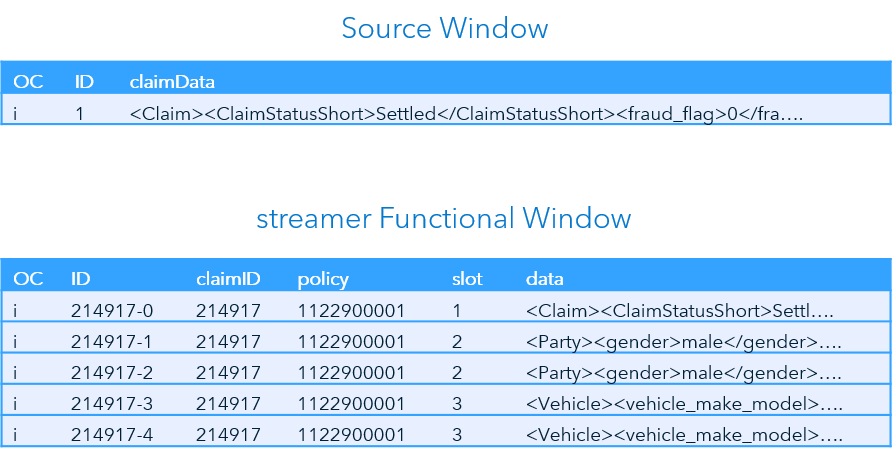
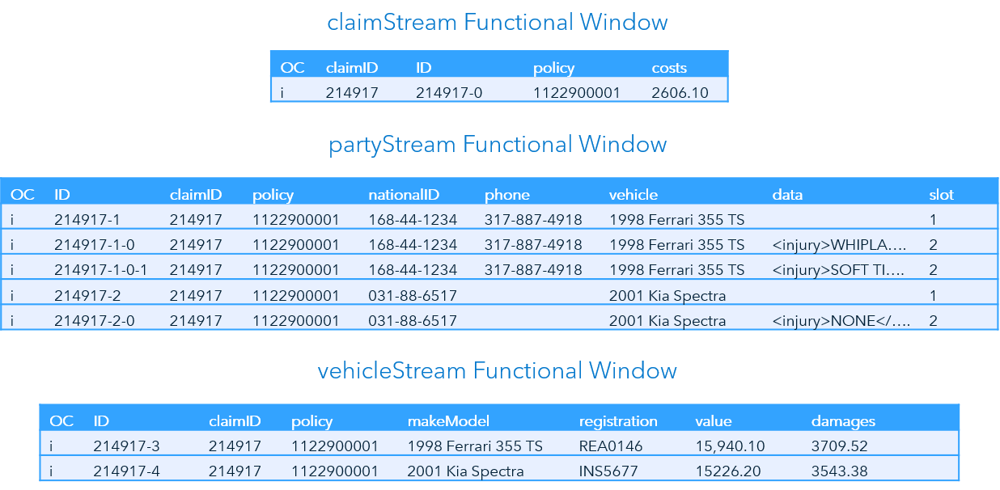
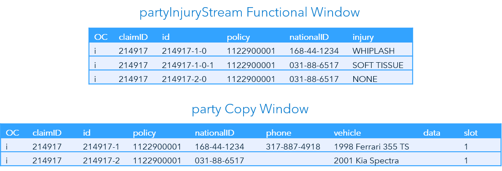
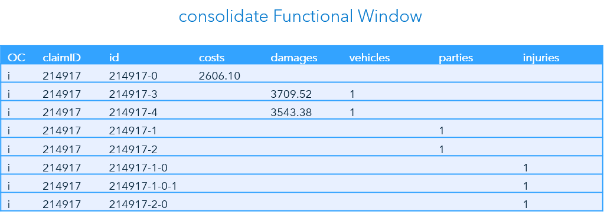
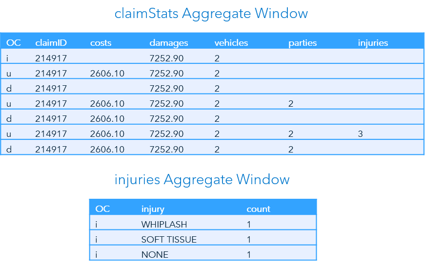

> Refer to the [Instructions](instructions.md) document for steps to execute this code snippet.

# functional_event_loop

The functional_event_loop code snippet is an example of the event looping capabilities of the functional window. The data involved represents several auto accident insurance claims. It is contained in relatively complex XML data. The model takes the XML into its source window and routes the data down different paths representing claims, parties, vehicles, and injuries. 

## Functional Window Overview

The Functional window allows you to call different functions to manipulate or transform event data. A schema and function context containing functions is defined. 

If a function exists with the same name as a field in the schema, the Functional window runs the function. If no function exists, the input field is copied to the output event.

Event loops are used to generate multiple output events from a single input event.

### XML Data

XML data is commonly used as input to an ESP model. However, XML data must be transformed into event data using functions. Additionally, XML data often includes complex data that is transformed into multiple events.

The following is an example of partial XML data for automobile insurance claims:

~~~xml
<Claim>
	…
	<Parties>
		<Party>
			…
			<injuries>
				<injury>SOFT TISSUE</injury>
				<injury>WHIPLASH</injury>
			</injuries>
		</Party>
		<Party>
			…
			<injuries>
				<injury>NONE</injury>
			</injuries>
		</Party>
	</Parties>
	<Vehicles>
		<Vehicle>
			…
		</Vehicle>
		<Vehicle>
			…
		</Vehicle>
	</Vehicles>
</Claim>
~~~

Within each claim there is claim data along with one or more parties and vehicles. Within each party there can be one or more injuries. Therefore, event loops are required for parties, vehicles, and injuries.

### Event Loops

As stated previously, event loops are used to generate multiple output events from a single input event. This is a common technique for reading structured complex input data such as XML or JSON.

The Functional window does the following for each event loop when an input event arrives:

- Uses a function or reference to generate the data to be used as input to the loop.
- Applies an expression, such as XPATH or JSON, to the data to retrieve 0 or more entities.
- For each of these entities, sets a data item and runs the appropriate function to generate an output event.

For example, the parties event loop uses the function `#xml` to generate valid xml as input to the loop. The XPATH expression `//Parties/Party` retrieves the appropriate events. Finally, the function for each entity is run to generate each output event.

### Function Context

Function context allows you define functions to transform complex input data into usable output. You can use regular expressions, XML and XPATH, JSON, and other capabilities. Event fields can be referenced in functions using the `$field` notation.

For example, each claim includes a `claimID` and one or more vehicles. If two vehicles exist, the ID of each vehicle should be `claimID-0` and `claimID-1`. Therefore, the following function is used:

~~~
string($claimId,'-',eventNumber())
~~~

## Event Flow Description

This example includes a single input event. There are six Functional windows to transpose the XML data, two Aggregate windows to compile statistics, and a Copy window.

The following is a description of how this event flows through the model.

### Source Window and streamer Functional Window

The event is inserted into the Source window with the entire string of XML data in the `claimData` field. The streamer Functional window includes the schema and function context for the claim, and event loops and function context for parties and vehicles.

Functions create a unique `ID` value and read `claimID` and `policy` from the XML data. Slot `1` is hard coded to direct the output, and the `data` field includes the claim information portion of the XML.

An event is output for each party and vehicle using event loops, and functions to populate the data field. Slot numbers `2` and `3` are used, respectively.

### claimStream, partyStream, and vehicleStream Functional Windows

The claimStream, partyStream, and vehicleStream Functional windows each receive the appropriate information based on the output slot numbers of the streamer Functional window.

All three windows use a function to create a unique `ID` for each event. They all include the `claimID` and `policy`. Each window uses functions to parse the appropriate information. 

The partyStream window streams five events; two are for the two parties involved, and three are for three injury events. Output slots are used to pass the appropriate information to two downstream windows.

### partyInjuryStream Functional and party Copy Windows

The appropriate information streams to the partyInjuryStream Functional window and the party Copy window based on the output slot used by the partyStream window. 

### consolidate Functional Window

The consolidate Functional window receives events from the claimStream, vehicleStream, party, and partyInjuryStream windows. It includes `cost` and `damages`, and functions to create flags that indicate which input stream contributed the event.

### claimStats and injuries Aggregate Windows

The last two windows in the model are the claimStats and injuries Aggregate windows. The claimStats Aggregate window receives events from the consolidate window and the injuries Aggregate window from the partyInjuryStream windows.

The claimStats window inserts the first event it receives. From the second event on, it uses updates and deletes to maintain the information in the most recent event. The sum function is used on all fields.

The injuries window maintains a running count of each injury type.

