> Refer to the [Instructions](instructions.md) document for steps to execute this code snippet.

# join_exp_xml

The join_exp_xml code snippet contains two source windows joined by a left outer join in a join window. The join window uses expressions to compute the non-key fields.

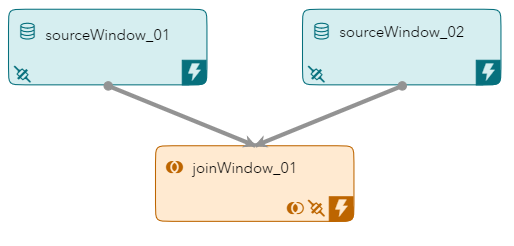

_Figure 1 - Model_

## Table of Contents

* [Join Window Overview](#join-window-overview)
	* [Join Types](#join-types)
	* [Streaming Joins](#streaming-joins)
	* [Regeneration and No Regeneration](#regeneration-and-no-regeneration)
	* [Configuring a Join in SAS ESP Studio](#configuring-a-join-in-sas-esp-studio)
	* [Expressions in Joins](#expressions-in-joins)
	* [Configuring Join Expressions in SAS ESP Studio](#configuring-join-expressions-in-sas-esp-studio)
	* [Connector Orchestration](#connector-orchestration)
* [Event Flow Description](#event-flow-description)
	* [Event 1](#event-1)
	* [Event 3](#event-3)
	* [Event 4](#event-4)
	* [Event 7](#event-7)
	* [Event 8](#event-8)
* [Other Repositories Using the Join Window](#other-repositories-using-the-join-window)

## Join Window Overview

Join windows receive events form a left and a right input window. A single output stream of joined events is produced. Joins are controlled by join types and join conditions.

### Join Types

You must specify a join type for a Join window. There are four types of joins supported:

| Join Type | Description |
| ------ | ------ |
| left-outer | Produces joined events for every event that arrives from the left window even if there is not a matching event from the right window. |
| right-outer | Produces joined events for every event that arrives from the right window even if there is not a matching event from the left window. |
| inner | Only creates a joined event when there are one or more matching events on the side opposite the input event. |
| full outer | Produces joined events for every event that arrives from the left or right window. Output events are always created. |

### Streaming Joins

Streaming joins differ from a traditional join in that streaming joins support new events being inserted into either source window at any time. Streaming joins can be thought of in this way:

- A single event from the left window can affect at most X events in the Join window.
- A single event from the right window can affect at most Y events in the Join window.

This example uses fact information in the left window and dimension information in the right window. Therefore, an event from the left window will affect a single event in the Join window. However, an event from the right window will affect many events in the Join window. This is known as a one-to-many join.

In a left-outer join all the keys in from the right window must correspond to a subset of keys from the left window. This is to guarantee the Join window has a unique set of keys.

### Regeneration and No Regeneration

By default, a join window regenerates the affected rows when a change occurs on either side of the join. You may or may not want this to occur. For example, several events have passed through a left-outer join when an update occurs on the right (dimension) side of the join. This change may affect many events. If regeneration is set, all events in need of update are regenerated by the Join window. This consumes resources. You can choose to not regenerate events under the Settings area for a Join Window.

### Configuring a Join in SAS ESP Studio

Use the following steps to configure a join using SAS ESP Studio:

1. Ensure the project is open, join window is selected, and the properties are displayed.

2. Expand **Join Criteria**.

    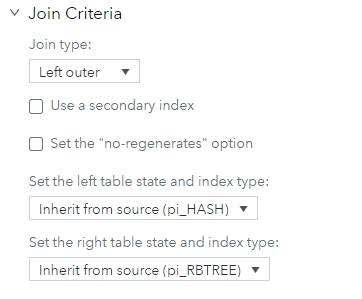

    _Figure 2 - Join Criteria_

3. Under **Join type**, select the type of join to be performed.

4. Expand **Join Conditions**.

    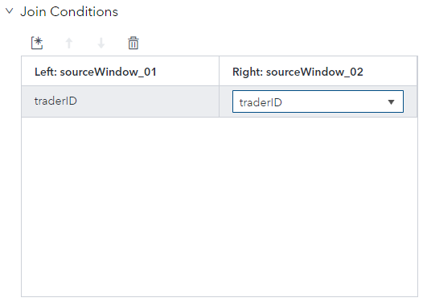

    _Figure 3 - Join Conditions_

5. Click 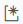 to add a new join condition. The fields are selection lists.

6. Select the appropriate key field from each of the source windows.

### Expressions in Joins

The non-key fields must be calculated using one of three methods:

- Field selection string 
- Field calculation expression
- Field calculation function

Join expressions allow you to perform calculations using input fields, or pass an input field through. The following is a join expression that calculates the total price by multiplying quantity and price from the left window (indicated by the prefix l_):

~~~
l_quantity * l_price
~~~

You can also pass a field through by typing the name of the field preceded by l_ or r_ (e.g., l_symbol).

### Configuring Join Expressions in SAS ESP Studio

Use the following steps to use join expressions for a join using SAS ESP Studio:

1. Ensure the project is open, join window is selected, and the properties are displayed.

2. Expand **Settings**.

    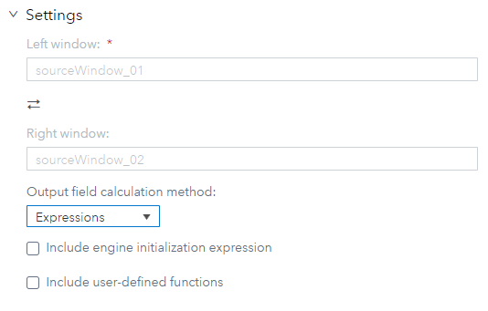

    _Figure 4 - Join Settings_

3. Under **Output field calculation method**, ensure **Expressions** is selected.

4. On the right side of the screen, click 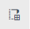 to display the output schema.

5. Click  to display the Edit Output Schema - Non-Key Fields screen.

    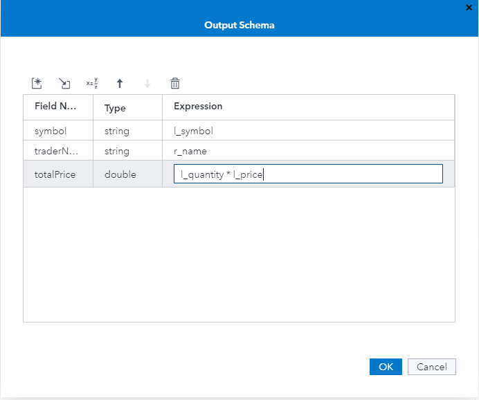

    _Figure 5 - Output Schema_

6. Click  to add a new field.

7. Under **Field name**, type a name for the new field.

8. Under **Type**, select the appropriate data type of the new field.

9. Under **Expression**, type the input field name or expression to calculate the output field.

10. Create any remaining fields and click **OK** to save your changes.

### Connector Orchestration

Input Data Connectors (publishers) use the ESP publish/subscribe API to read event data from a specified source. By default, multiple publishing connectors run concurrently. However, you can orchestrate connectors to publish data in a specific way.

This example uses connector orchestration to load the fact information (left window) first. The connector for the dimension information (right window) waits for the first connector to finish before it publishes events.

## Event Flow Description

This example includes four input events for Source Window 1 and four input events for Source Window 2. Source Window 2 loads dimension information completely before Source Window 1 loads fact information. The Join window is set to perform a left-outer join with `traderID` being the join key.

The following is a description of how these events flow through the model.

### Event 1

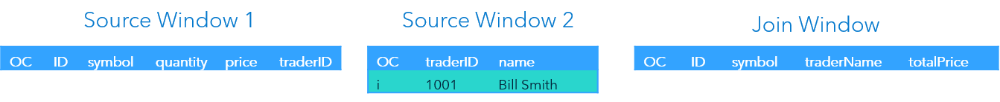

_Figure 6 - Event 1_

The first event is inserted into Source Window 2 and it streams to the Join window. The Join window does not insert an event because it is performing a left-outer join and there is no event from the left window.

### Event 3

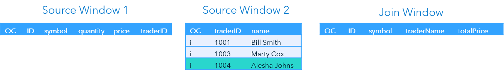

_Figure 7 - Event 3_

The third event is the last event inserted into Source Window 2.  Again, the Join window does not insert an event because it is performing a left-outer join and there is no event from the left window.

### Event 4

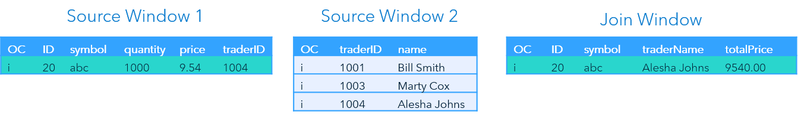

_Figure 8 - Event 4_

Source Window 1 inserts an event and it streams to the Join window. The Join window outputs an event with ID and symbol from Source Window 1, traderName from Source Window 2, and the calculated field totalPrice.

### Event 7

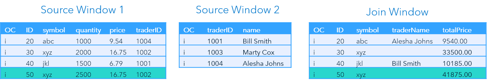

_Figure 9 - Event 7_

The seventh event again inserts an event into Source Window1 and streams to the Join window. The Join window again outputs an event, but traderName is blank because there is no match for traderID 1002.

### Event 8

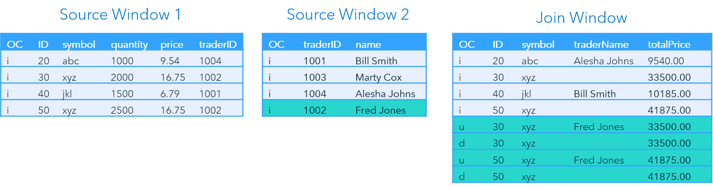

_Figure 10 - Event 8_

The next event is another insert event for Source Window 2. The event streams to the Join window.

An event arriving at the dimension side of the join can potentially affect many events in the Join window. the Join window contains two events for `traderID 1002`, so both events must be updated. This illustrates the concept of a one-to-many join. The Join window then streams delete events for the original events.

## Other Repositories Using the Join Window

- [Zambretti Algorithm for Weather Forecasting](https://github.com/sassoftware/iot-zambretti-weather-forcasting)
- [Processing Streaming Trade Data](https://github.com/sassoftware/iot-process-streaming-trade-data)

