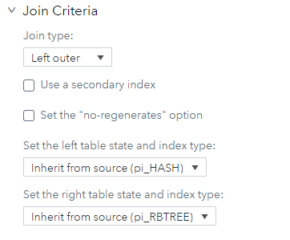
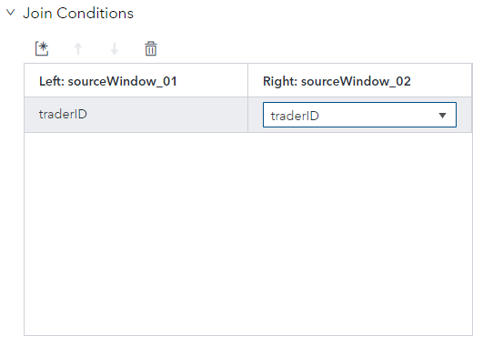

> Refer to the [Instructions](instructions.md) document for steps to execute this code snippet.

# join_select_xml

The join_select_xml example contains two source windows joined by a left outer join in a join window. The join window uses field-selections to select the non-key fields.

_Figure 1 - Model_

## Table of Contents

* [Join Window Overview](#join-window-overview)
	* [Join Types](#join-types)
	* [Streaming Joins](#streaming-joins)
	* [Regeneration and No Regeneration](#regeneration-and-no-regeneration)
	* [Configuring a Join in SAS ESP Studio](#configuring-a-join-in-sas-esp-studio)
	* [Field Selection](#field-selection)
	* [Performing Field Selection in SAS ESP Studio](#performing-field-selection-in-sas-esp-studio)
	* [Connector Orchestration](#connector-orchestration)
* [Event Flow Description](#event-flow-description)
	* [Event 1](#event-1)
	* [Event 4](#event-4)
	* [Event 5](#event-5)
	* [Event 6](#event-6)
	* [Event 7](#event-7)
	* [Event 8](#event-8)
* [Other Repositories Using the Join Window](#other-repositories-using-the-join-window)

## Join Window Overview

Join windows receive events form a left and a right input window. A single output stream of joined events is produced. Joins are controlled by join types and join conditions.

### Join Types

You must specify a join type for a Join window. There are four types of joins supported:

| Join Type | Description |
| ------ | ------ |
| left-outer | Produces joined events for every event that arrives from the left window even if there is not a matching event from the right window. |
| right-outer | Produces joined events for every event that arrives from the right window even if there is not a matching event from the left window. |
| inner | Only creates a joined event when there are one or more matching events on the side opposite the input event. |
| full outer | Produces joined events for every event that arrives from the left or right window. Output events are always created. |

### Streaming Joins

Streaming joins differ from a traditional join in that streaming joins support new events being inserted into either source window at any time. Streaming joins can be thought of in this way:

- A single event from the left window can affect at most X events in the Join window.
- A single event from the right window can affect at most Y events in the Join window.

This example uses fact information in the left window and dimension information in the right window. Therefore, an event from the left window will affect a single event in the Join window. However, an event from the right window will affect many events in the Join window. This is known as a one-to-many join.

In a left-outer join all the keys in from the right window must correspond to a subset of keys from the left window. This is to guarantee the Join window has a unique set of keys.

### Regeneration and No Regeneration

By default, a join window regenerates the affected rows when a change occurs on either side of the join. You may or may not want this to occur. For example, several events have passed through a left-outer join when an update occurs on the right (dimension) side of the join. This change may affect many events. If regeneration is set, all events in need of update are regenerated by the Join window. This consumes resources. You can choose to not regenerate events under the Settings area for a Join Window.

### Configuring a Join in SAS ESP Studio

Use the following steps to configure a join using SAS ESP Studio:

1. Ensure the project is open, join window is selected, and the properties are displayed.

2. Expand **Join Criteria**.

    

    _Figure 2 - Join Criteria_

3. Under **Join type**, select the type of join to be performed.

4. Expand **Join Conditions**.

    

    _Figure 3 - Join Conditions_

5. Click  to add a new join condition. The fields are selection lists.

6. Select the appropriate key field from each of the source windows.

### Field Selection

The non-key fields must be calculated using one of three methods:

- Field selection string 
- Field calculation expression
- Field calculation function

Field selection provides a one-to-one mapping of input non-key fields to join fields. You can select fields from both source windows if two source windows are used as input to the join.

### Performing Field Selection in SAS ESP Studio

Use the following steps to select fields for a join using SAS ESP Studio:

1. Ensure the project is open, join window is selected, and the properties are displayed.

2. Expand **Settings**.

    

    _Figure 4 - Join Settings_

3. Under **Output field calculation method**, ensure **Select fields** is selected.

4. On the right side of the screen, click  to display the output schema.

5. Click  to display the Edit Output Schema - Non-Key Fields screen.

    

    _Figure 5 - Output Schema_

6. Click  to add a new field.

7. Under **Field name**, type a name for the new field.

8. Under **Window**, select the input window from which the field is to come.

9. Under **Field**, select the appropriate input field. The Type column is populated automatically.

10. Create any remaining fields and click **OK** to save your changes.

### Connector Orchestration

Input Data Connectors (publishers) use the ESP publish/subscribe API to read event data from a specified source. By default, multiple publishing connectors run concurrently. However, you can orchestrate connectors to publish data in a specific way.

This example uses connector orchestration to preload the dimension information (right window) before loading the fact information (left window). The connector for the fact information (right window) waits for the other connector to finish before it publishes events. This is a common orchestration used to ensure matches in the Join window.

## Event Flow Description

This example includes four input events for Source Window 1 and four input events for Source Window 2. Source Window 2 loads dimension information completely before Source Window 1 loads fact information. The Join window is set to perform a left-outer join with `traderID` being the join key.

The following is a description of how these events flow through the model.

### Event 1

_Figure 6 - Event 1_

The first event is inserted into Source Window 2 and it streams to the Join window. The Join window does not insert an event because it is performing a left-outer join and there is no event from the left window.

### Event 4

_Figure 7 - Event 4_

The fourth event is the last event inserted into Source Window 2.  Again, the Join window does not insert an event because it is performing a left-outer join and there is no event from the left window.

### Event 5

_Figure 8 - Event 5_

The next event is the first input event for Source Window 1. Because of connector orchestration, Source Window 2 had to finish loading before this event could be inserted into Source Window 1. The event streams to the Join window.

An event arriving at the fact side of the join can affect a single event in the Join window. Therefore, the Join window inserts an event with the information from the left window and the matching information (`traderName`) from the right window.

### Event 6

_Figure 9 - Event 6_

The next event is again inserted into Source Window 1 and it streams to the Join window. The Join window again inserts an event with the information from the left window and the matching information (`traderName`) from the right window.

### Event 7

_Figure 10 - Event 7_

An Update event arrives at Source Window 2 and streams to the Join window. Because an event arriving at the fact side of the join can affect a single event in the Join window, an update event is streamed with all the appropriate information.

### Event 8

_Figure 11 - Event 8_

The last event is a Delete event into Source Window 1. The event streams to the Join window where a Delete event is streamed with all the information.

## Other Repositories Using the Join Window

- [Zambretti Algorithm for Weather Forecasting](https://github.com/sassoftware/iot-zambretti-weather-forcasting)
- [Processing Streaming Trade Data](https://github.com/sassoftware/iot-process-streaming-trade-data)

