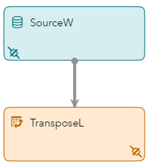
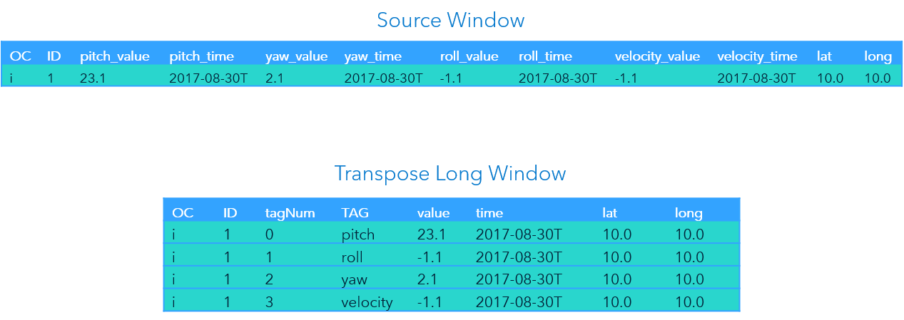

> Refer to the [Instructions](instructions.md) document for steps to execute this code snippet.

# transpose_long

The transpose_long code snippet includes a single source window and a transpose window. This example transposes information in long mode. It processes information about the pitch, yaw, roll, and velocity of an aircraft in flight.

## Transpose Window Overview

Events can be visualized as a row of information with columns. A Transpose window converts an event’s columns into rows, or rows into columns.

There are two modes for the Transpose window, wide and long. The following table provides a description of these modes:

| Mode | Description |
| ------ | ------ |
| wide | Converts event rows into columns. Produces one event per incoming event. |
| long | Converts event columns into rows. Produces one or more events per incoming event. |

### Long Mode

In long mode, an incoming event’s columns are transposed into rows. The Transpose window streams several events for each wide input event. For example, an input event includes columns for an aircraft’s pitch, roll, yaw, and velocity. The Transpose window in long mode will output one event for pitch, another event, for roll, and so on.

### Tags

The Transpose window is controlled by tags. There are two parameters, `tag-values` and `tags-included`, that provide the tag information. The following table provides an explanation of these parameters:

| Parameter | Explanation |
| ------ | ------ |
| tag-values | Specifies the values of each tag that are in columns. Example: value, time |
| tags-included | Specifies the tags or sets of columns. Example: pitch, roll, yaw, velocity |

The input schema of the Transpose window must include combinations of tags and tag-values as field names. For example, there must be a field for `pitch_value`, `pitch_time`, `roll_value`, `roll_time`, etc.

## Event Flow Description

This example includes a single wide input event. The Transpose window is in long mode. The `tag-values` are `value` and `time`. The `tags-included` are `pitch`, `roll`, `yaw`, and `velocity`.

The following is a description of how this event is processed by the Transpose window.

### Event #1

The Source window inserts the event and it streams to the Transpose window. The Transpose window processes the first tag, `pitch`. It streams an event with an `ID` of `1`, `tagNum 0`, `TAG pitch`, `value` (from pitch_value), `time` (from pitch_time), `lat`, and `long`. 

The Transpose window then streams an event each for `roll`, `yaw`, and `velocity`.

