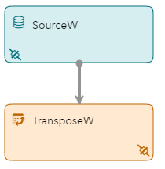
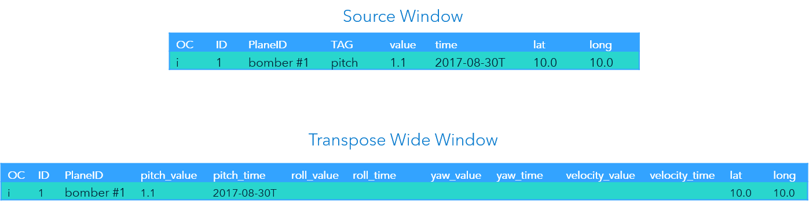
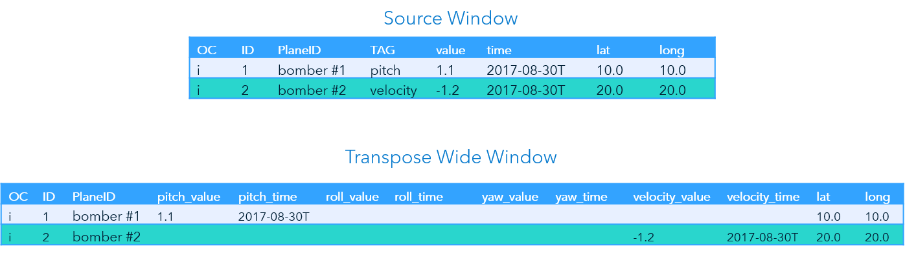
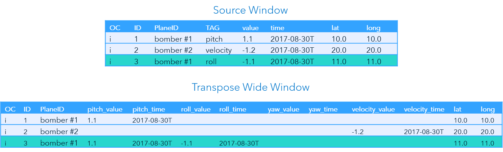
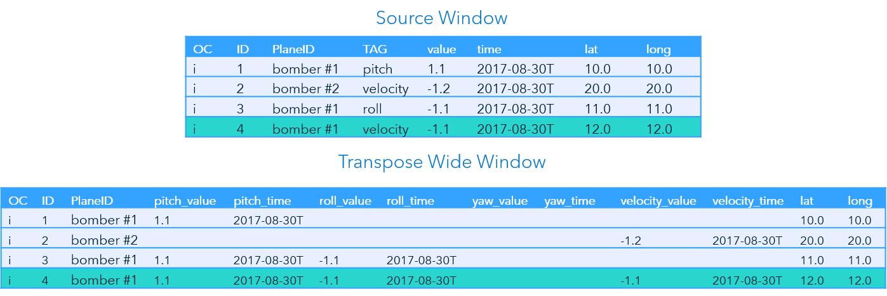

> Refer to the [Instructions](instructions.md) document for steps to execute this code snippet.

# transpose_wide

The transpose_wide code snippet includes a single source window and a transpose window. This example transposes information in wide mode. It processes information about the pitch, yaw, roll, and velocity of an aircraft in flight.

## Transpose Window Overview

Events can be visualized as a row of information with columns. A Transpose window converts an event’s columns into rows, or rows into columns.

There are two modes for the Transpose window, wide and long. The following table provides a description of these modes:

| Mode | Description |
| ------ | ------ |
| wide | Converts event rows into columns. Produces one event per incoming event. |
| long | Converts event columns into rows. Produces one or more events per incoming event. |

### Wide Mode

In wide mode, multiple incoming events are transposed into a single event. The Transpose window streams an event with multiple sets of columns for the input events. 

For example, each input event contains information about either an aircraft’s pitch, roll, yaw, or velocity. It takes four input events to receive all the information. The Transpose window in wide mode will output one event with columns for pitch, roll, yaw and velocity. It populates the columns as the events are received and retains values from previous iterations until a complete record is streamed.

### Tags

The Transpose window is controlled by tags. There are two parameters, `tag-values` and `tags-included`, that provide the tag information. The following table provides an explanation of these parameters:

| Parameter | Explanation |
| ------ | ------ |
| tag-values | Specifies the values of each tag that are in columns. Example: value, time |
| tags-included | Specifies the tags or sets of columns. Example: pitch, roll, yaw, velocity |

The input schema of the Transpose window includes a field to identify the tag and fields for each `tag-value` (e.g., value, time). The event streamed will include columns for each combination of `tags-included` and `tag-values` (e.g., pitch_value, pitch_time, roll_value ).

## Event Flow Description

This example includes four input events. The Transpose window is in wide mode. The `tag-values` are `value` and `time`. The `tags-included` are `pitch`, `roll`, `yaw`, and `velocity`.

The following is a description of how these events are processed by the Transpose window.

### Event 1

The Source window inserts an event for `bomber #1` for the TAG `pitch`. The event streams to the Transpose window. The Transpose window streams an event for `bomber #1` that includes all the required columns. However, only the columns for the input information are populated. 

### Event 2

The Source window inserts an event for `bomber #2` for the TAG `velocity`. The event streams to the Transpose window.

The Transpose window again inserts an event. Since this is the first event for `bomber #2`, `pitch_value` and `pitch_time` are not retained from the previous event. The columns for `velocity_value` and `velocity_time` are populated along with `lat` and `long`.

### Event 3

The Source window now inserts a second event for `bomber #1`. The event is for the TAG `roll`. The information streams to the Transpose window.

The Transpose window inserts an event. Since this is not the first event for `bomber #1`, the values of `pitch_value` and `pitch_time` are retained from the first event for `bomber #1`. The values for `roll_value` and `roll_time` are also populated along with `lat` and `long`.

### Event 4

The fourth event is also for `bomber #1`, for the TAG `velocity`. The Source window inserts the event and it streams to the Transpose window.

The Transpose window inserts an event. This is the third event for `bomber #1`. Therefore, the values for `pitch_value`, `pitch_time`, `roll_value`, and `roll_time` are retained. The values for `velocity_value` and `velocity_time`, `lat`, and `long` are populated.

