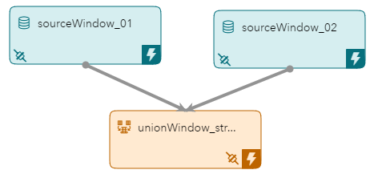
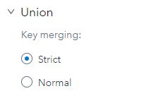
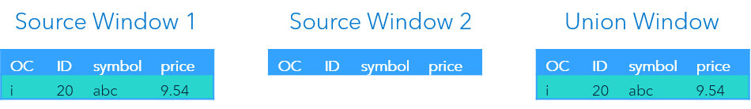
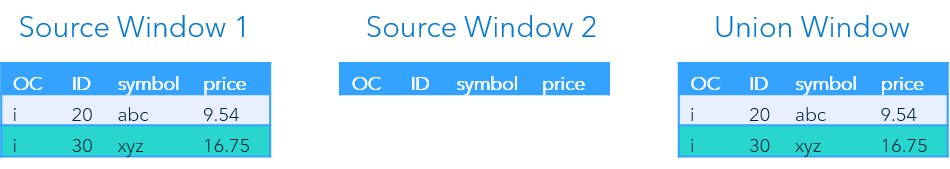
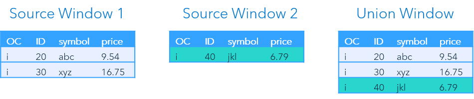
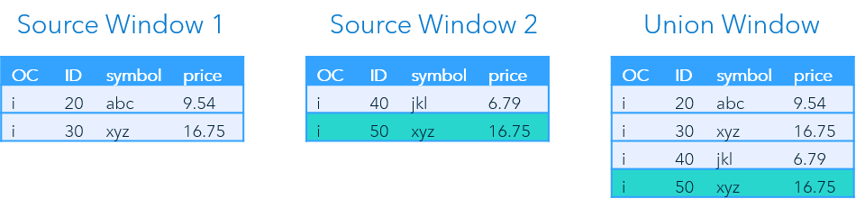
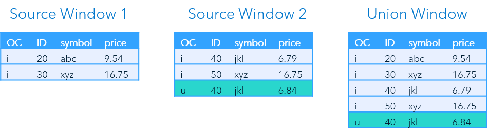
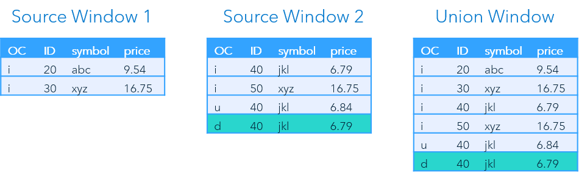
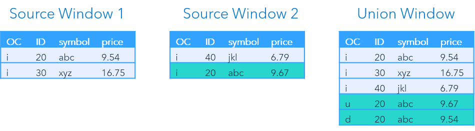

> Refer to the [Instructions](instructions.md) document for steps to execute this code snippet.

# union_xml

The union_xml code snippet includes two source windows and a single union window to combine the streams. 

_Figure 1 - Model_

## Table of Contents

* [Combining Event Streams Overview](#combining-event-streams-overview)
	* [Strict vs Normal Policy](#strict-vs-normal-policy)
	* [Configuring a Union in SAS ESP Studio](#configuring-a-union-in-sas-esp-studio)
* [Event Flow Description Strict Policy](#event-flow-description-strict-policy)
	* [Event 1](#event-1)
	* [Event 2](#event-2)
	* [Event 3](#event-3)
	* [Event 4](#event-4)
	* [Event 5](#event-5)
	* [Event 6](#event-6)
* [Event Flow Description Normal Policy](#event-flow-description-normal-policy)
* [Other Repositories Using the Union Window](#other-repositories-using-the-union-window)

## Combining Event Streams Overview

Event streams can be combined using a Union window. All input windows to a union must have the same schema. The output is a single event stream with information from multiple input windows.

### Strict vs Normal Policy

A Union window uses either a strict or normal policy to combine event streams. If using the strict policy, an insert event for the same key cannot be sent from separate windows. However, if the policy is normal this criteria is loosened. For the normal policy, all Insert events are converted to Upserts.

### Configuring a Union in SAS ESP Studio

Use the following steps to configure a union using SAS ESP Studio:

1. Ensure the project is open, union window is selected, and the properties are displayed.

2. Expand **Union**.

    

    _Figure 2 - Union_

3. Select either **Strict** or **Normal** as appropriate.

## Event Flow Description Strict Policy

This example includes six input events. The two Source windows have the same schema and the Union window is set to use the strict policy.

The following is a description of how these events flow through the model.

### Event 1

_Figure 3 - Event 1_

The first event is an Insert event into Source Window 1. The event streams to the Union window where it is inserted.

### Event 2

_Figure 4 - Event 2_

The second event again inserts an event into Source Window 1. The event streams to the Union window where it is again inserted.

### Event 3

_Figure 5 - Event 3_

The third event is an Insert event into Source Window 2. The event streams to the Union window where it is inserted.

### Event 4

_Figure 6 - Event 4_

The next event is also an Insert event into Source Window 2. Again, the Union window inserts the event.

### Event 5

_Figure 7 - Event 5_

The fifth event is an Update event for `ID 40` into Source Window 2. Since `ID 40` was originally sent from Source Window 2, the Union window adds an Update event.

### Event 6

_Figure 8 - Event 6_

Now a Delete event for the original record for `ID 40` is processed by Source Window 2. A Delete event is streamed by the Union window.

## Event Flow Description Normal Policy

This example includes four input events. The two Source windows have the same schema and the Union window is set to use the normal policy.

The first three events are streamed just like in the previous example.

_Figure 9 - Normal Policy_

The fourth event is an Insert event for `ID 20` into Source Window 2. An event for `ID 20` was previously added by Source Window 1. Since the Union Window converts all Inserts into Upserts when in normal mode, it outputs an Update event with updated information, and a Delete event for the original event.

## Other Repositories Using the Union Window

- [Zambretti Algorithm for Weather Forecasting](https://github.com/sassoftware/iot-zambretti-weather-forcasting)

